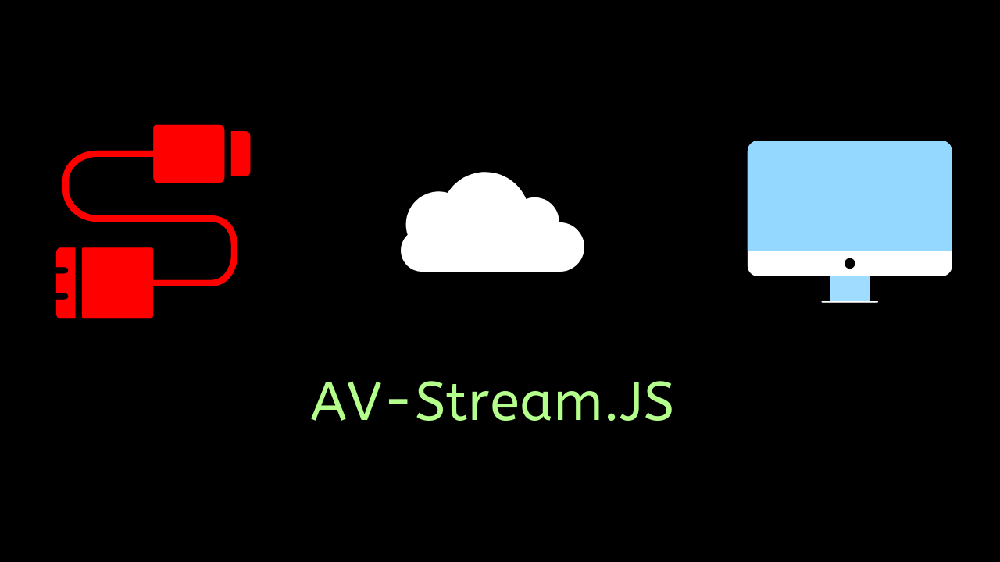

# Audio-Video-Stream.js

<div align="center">
	<div>
		
	</div>
</div>

 A small 500 byte JavaScript library leveraging the native MediaRecorder API to allow streaming of audio or video files to server. 
 
 It works by looping the MediaRecorder every **x** milliseconds, which can be used to generate and stream a file at every loop step.

## Usage
Including script in browser :

    <script src="https://unpkg.com/avstream.js/avstream.min.js"></script>

To use functions in your JS file :

    const { startStream, stopStream } = AVStream    

## Functions
1) ```startStream(mediaRecorder,time)``` 

*startStream* takes your **mediaRecorder** variable, and **time** in milliseconds. The MediaRecorder is restarted according to the time you provide.

This causes ```mediaRecorder.onStop()``` to be called every **time** milliseconds. So, you can write your blob creation and server call in that function.

2) ```stopStream()``` 

*stopStream* stops the stream.

## Tutorial


```javascript
// Record & Stop buttons of your HTML
const record = document.querySelector('#recordbutton')
const stop = document.querySelector('#stopbutton')

// Importing necessary variables
const { MediaRecorder, Blob } = window
const {startStream,stopStream} = AVStream

// Checking if browser allows getUsermedia
if (navigator.mediaDevices.getUserMedia) {
  console.log('getUserMedia supported.')

  // Setting constraints for MediaRecorder
  const constraints = { audio: true, video: false }

  // Declare chunks for our blob
  let chunks = [];

  const onSuccess = (stream) => {

    // Creating a MediaRecorder object
    const mediaRecorder = new MediaRecorder(stream)

    // if record button clicked, call startstream 
    // with our mediarecorder object and a 1000ms loop
    record.onclick = () => {
      startStream(mediaRecorder,1000)
      console.log(mediaRecorder.state)
      console.log('recorder started')
    }

    // stop stream if stop button clicked
    stop.onclick = () => {
      stopStream()
      console.log(mediaRecorder.state)
      console.log('recorder stopped')
    }

    // Blob created and streamed to server
    // Looped according to time we specify
    mediaRecorder.onstop = () => {
      console.log('data available after MediaRecorder.stop() called.')

      // Create file from chunks
      const blob = new Blob(chunks, { 'type' : 'audio/wav' })
      
      // Write code to send blob to server here

      // Clear chunks for new file
      chunks = [];
    }

    // Push chunks when data is available
    mediaRecorder.ondataavailable = e => chunks.push(e.data);
  }

  // Promise call to start our code
  navigator.mediaDevices.getUserMedia(constraints).then(onSuccess).catch((err)=>{console.error(err)})
} else {
  console.error('getUserMedia not supported on your browser!')
}
```

## License
The MIT License (MIT)